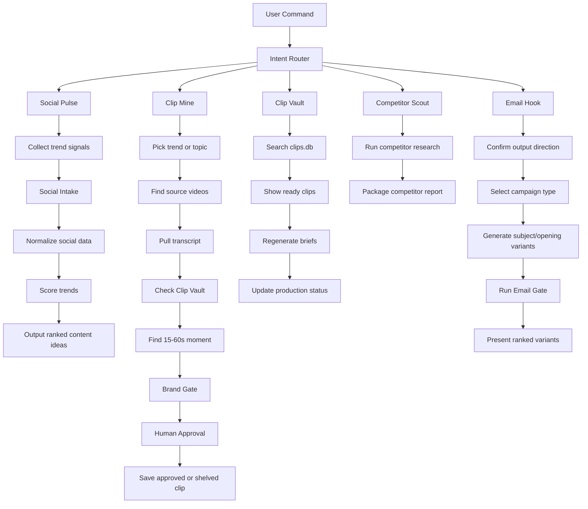
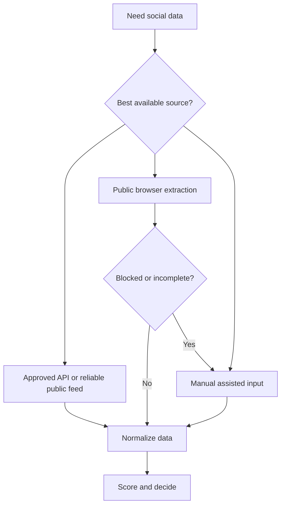

# Goblin Recon Architecture

Goblin Recon is a semi-autonomous content intelligence system. It helps the team discover trends, find source videos, extract clip moments, package briefs, and remember decisions. It does not replace human judgment or editor production.

## Core Principle

Professional agents stay narrow, observable, and recoverable.

Goblin Recon follows this pattern:

```text
Router -> Workflow -> Tools -> Normalized Data -> Score -> Human Gate -> Memory
```

The agent should not try to run every source, every tool, and every workflow for every request. It routes the user request to one focused workflow, uses the minimum reliable tools, presents decision-ready output, and stores only useful memory.

## System Map



## The Four Core Workflows

### 1. Social Pulse

Purpose: find trending AI stories, hooks, formats, and content angles.

Inputs:
- `run social pulse`
- `run fast scan`
- `run deep social scan`
- `what formats are working?`
- `content strategy this week`
- `manual scan this [URL/screenshot/caption]`

Output: 5-10 ranked content opportunities with source URLs, publication dates, hook style, format type, trend score, confidence, and recommended next action.

Social Pulse is intelligence, not production. It should not produce final clip briefs unless the user explicitly moves into Clip Mine.

### 2. Clip Mine

Purpose: find source videos and extract 15-60 second editor-ready moments.

Inputs:
- `run clip mine`
- `find clips about [topic]`
- `find the moment in [URL]`

Output: 1-3 decision-ready clip briefs with timestamp links, source access, embed preview, clip window, caption, platform variants, vault check, and rights-review note.

Clip Mine preserves the original core architecture:

```text
Trend Radar -> Source Hunter -> Moment Finder -> Brand Gate -> Human Gate
```

### 3. Clip Vault

Purpose: remember approved, shelved, and production-status clips across sessions.

Inputs:
- `what clips are ready`
- `search clips about [topic]`
- `show clip [clip_id]`
- `update clip status`

Storage:
- `vault/clips.db`
- `vault/briefs/`
- `memory/trend-history.md`

Output: approved clip lists, regenerated briefs, duplicate warnings, and production status updates.

### 4. Email Hook

Purpose: generate and validate outbound email subject lines, openers, and short drafts.

Inputs:
- `write email hooks for [offer/audience]`
- `write subject lines for [campaign]`
- `validate this email`

Output: ranked subject/opening variants with attention, psychological fit, brand voice, professional guardrail, and campaign alignment scores.

Email Hook preserves the same gate-first architecture:

```text
Output Direction -> Campaign Fit -> Email Gate -> Human Gate
```

## Intent Router

The router chooses exactly one primary workflow before tools are used.

| User Intent | Workflow | Notes |
|---|---|---|
| Find trends or ideas | Social Pulse | Use scan mode to control depth. |
| Find source video clips | Clip Mine | Run dedup before Moment Finder. |
| Retrieve previous clips | Clip Vault | Query `vault/clips.db` first. |
| Analyze competitors | Competitor Scout | Separate from trend and clip work. |
| Validate brand fit | Brand Gate | Can run as a standalone review. |
| Generate email hooks or outbound drafts | Email Hook | Ask Output Direction first, then run Email Gate. |

If a request mixes workflows, run the smallest useful sequence and tell the user what sequence is being used.

## Output Direction

Before producing brand-facing output, the router asks three questions in one short checkpoint:

1. Who is this for? B2C, B2B, or Both?
2. Where does it go? Faceless Instagram, personal brand, client work, internal use, email/outbound, or other?
3. What tone should it carry? Professional, casual, edgy, warm, wry, bold, or platform-native?

The answer controls brand angle, destination, tone, scoring lens, template choice, and copy guardrails. If the user skips direction, default to Both / Faceless Instagram / professional and state that default before generating.

## Scan Modes

### Fast Scan

Use for low-stress daily work.

Sources:
- YouTube
- Reddit
- Tech news
- Product Hunt
- X/Twitter only if approved API or public access is available

Goal: produce useful candidates quickly without relying on fragile social scraping.

### Deep Social Scan

Use for weekly social-native discovery or important launches.

Sources:
- Instagram public creator pages
- TikTok public pages or hashtags
- X/Twitter validation
- Reddit and tech news validation

Goal: understand hooks, formats, viral signals, and creator patterns. Stop or downgrade when platforms block access.

### Manual Assisted Scan

Use when the human already has promising material.

Inputs:
- URLs
- Screenshots
- Captions
- Creator handles
- Notes from manual monitoring

Goal: normalize, score, and turn human-provided signals into usable trend or clip candidates.

## Social Extraction Reliability Ladder

Social extraction is the current highest-priority operational constraint. Goblin Recon must not rely on "try to scrape everything" as its main strategy. It must capture social data through a stable intake layer.

Extraction must follow this order:



Rules:
- Never bypass login, paywall, captcha, robots.txt, rate limits, or platform restrictions.
- Never use personal employee accounts for automation.
- If public extraction fails, mark `access_status: blocked` and switch to manual assisted input.
- Treat Instagram and TikTok browser extraction as useful but fragile, not as the foundation of the system.

## Social Intake Layer

All social data, regardless of source, must pass through `goblin_recon.tools.social_intake` before Trend Radar scoring.

Accepted inputs:
- Approved API output
- Public browser observations
- User-provided URLs
- Screenshot summaries
- Captions
- Visible metrics
- Creator handles
- Manual notes

Core commands:

```bash
.venv/bin/python -m goblin_recon.tools.social_intake --input vault/intake/social-signal.json
.venv/bin/python -m goblin_recon.tools.social_intake --url "https://www.instagram.com/reel/..." --topic "AI agents" --caption "..."
.venv/bin/python -m goblin_recon.tools.social_intake --input vault/intake/social-signal.json --store
```

Default local store:

```text
vault/social-signals.jsonl
```

The store is ignored by Git because it may contain unpublished content notes.

## Normalized Social Record

Every social signal should be converted into this shape before scoring:

```text
platform:
creator:
url:
published_date:
views:
likes:
comments:
caption:
hook:
format_type:
topic:
category:
why_it_is_trending:
can_genx_adapt_this:
confidence:
access_status:
```

This keeps the agent from mixing raw platform fragments with final recommendations.

## Tool Policy

Tools are helpers, not the architecture.

| Tool or Integration | Role | Default |
|---|---|---|
| Built-in browser/web | Public inspection and discovery | Allowed when public access is available. |
| `goblin_recon.tools.youtube_tool` | YouTube transcript extraction | Core Clip Mine tool. |
| `goblin_recon.tools.clip_extractor` | Clip timestamp validation | Core Clip Mine tool. |
| `goblin_recon.tools.social_intake` | Normalize API/public/manual social signals | Core Social Pulse tool. |
| `goblin_recon.tools.clip_store` | Save clip metadata | Core Clip Vault tool. |
| `scripts/query_clips.py` | Retrieve clips and regenerate briefs | Core Clip Vault tool. |
| `goblin_recon.tools.brand_gate` | Check generated copy for blacklist and nuance words | Core Brand Gate helper. |
| `goblin_recon.tools.email_gate` | Score outbound email drafts across five quality dimensions | Core Email Hook helper. |
| MCP Memory | Store approved/shelved patterns | Optional, useful early. |
| Fetch MCP | Extract normal public webpages | Optional, useful early. |
| Firecrawl | Public web/news extraction | Later, after API key approval. |
| Ghost Browser | JS-heavy public pages | Fallback only. |
| Meta Instagram API | Approved Instagram data | Later, approval required. |
| X/Twitter API | Approved public search/recent posts | Later, approval required. |
| Reddit API | Approved public subreddit data | Good reliability candidate. |
| YouTube Data API | Public metadata | Optional; transcripts do not need it. |

Do not add integrations because they exist. Add them only when a workflow step is repeatedly painful and the integration is approved, read-only, and reliable.

### Browser Extraction Discipline

- Do not guess article URLs from headlines or slugs. Extract real links from category pages, search pages, feeds, sitemaps, or approved APIs.
- After one 404, stop guessing and return to an index/search page to extract the canonical `href`.
- If a page returns a block page, captcha, DataDome/JS challenge, login wall, or rate-limit response, confirm once, mark `access_status: blocked`, and move on.
- For JavaScript-heavy news pages, prefer broad link extraction before narrow selectors. The Verge often requires selecting generic image-backed links, for example: `main > div > a[href]` filtered to anchors with an image and a `theverge.com` URL.

## Memory Policy

Store:
- Approved clips
- Shelved clips with reasons
- Duplicate decisions
- Strong hook/format patterns
- Recurring brand-gate decisions
- Production statuses

Do not store:
- API keys, cookies, tokens, or secrets
- Full raw transcripts by default
- Private personal data
- Login-only or restricted source data
- Unreviewed claims as facts

## Failure Behavior

The agent should fail cleanly.

| Failure | Behavior |
|---|---|
| Source has no URL | Do not include it. |
| Publication date missing | Mark low confidence or shelve. |
| Platform blocks access | Stop that source and switch to manual assisted input. |
| Article URL returns 404 | Retry once by extracting a real `href`; do not keep guessing slugs. |
| Claim has only one source | Mark unverified. |
| Clip overlaps vault history | Differentiate or shelve before extraction. |
| Brand gate fails | Shelve before Human Gate. |
| Human does not approve | Do not save as approved or send to editor. |

## Professional Operating Model

Goblin Recon should stay semi-autonomous:

```text
Agent gathers -> Agent structures -> Agent scores -> Human approves -> Agent stores -> Editor produces
```

This is intentional. The agent does leverage work; the human keeps judgment, rights review, and publishing approval.
